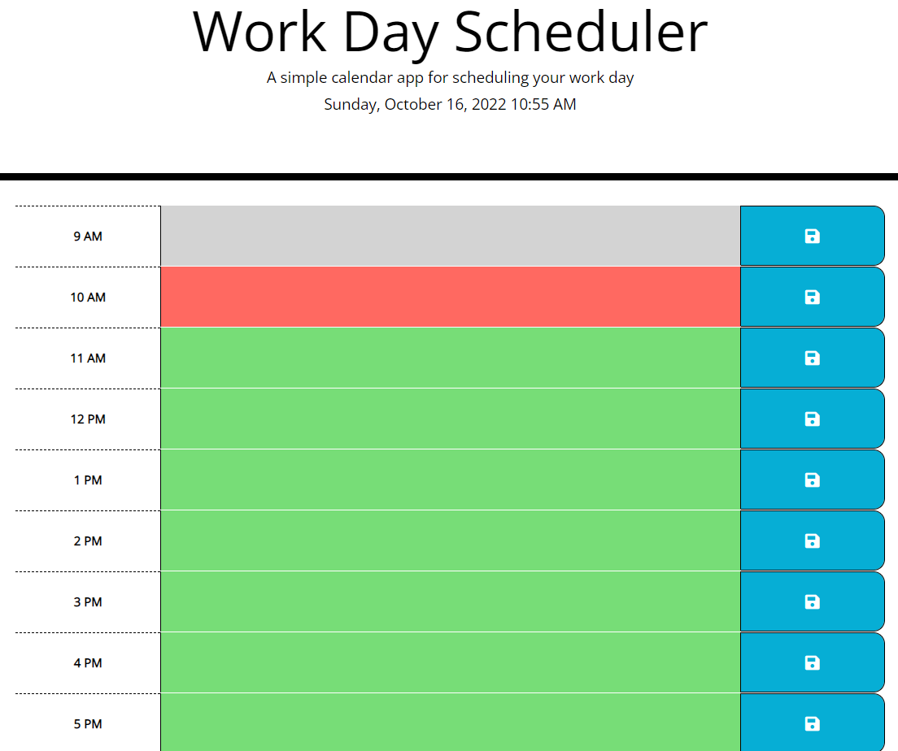

# Work Day Scheduler

## The Task
Create a calendar application that allows the user to save events for each hour of the day


## How does this application work?
When the user first open the application, he/she will be brought to the main page. 

There are two parts on the main page: Header & Event Table.

The header is used to display current day and time. 

The event table is used to save the user's input events. The application tracks the current time and event time in
the background and display a different color for user visualization. The saved event will be displayed in the 
table according to the time
 
## User Story

```
An employee wants to add important events to a daily planner
```

## Acceptance Criteria

```
This application should include:
1. The current day is displayed at the top of the calendar when user open the application.
2. A time block is presented to the user.
3. Each time block is color coded to indicate whether it is in the past, present, or future.
4. User can enter the event into the time block
5. The event is saved in local storage when user click the save button for that time block
6. The saved events persist when user refresh the page
```

## Moke Up

The following image shows the web application's appearance:

*Main Page:*



## URL
https://ykuang321.github.io/Work-Day-Schduler/